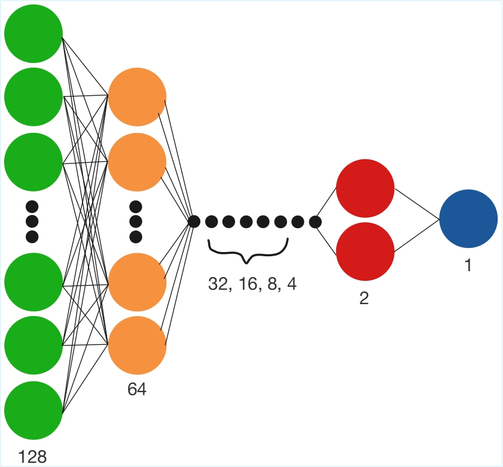
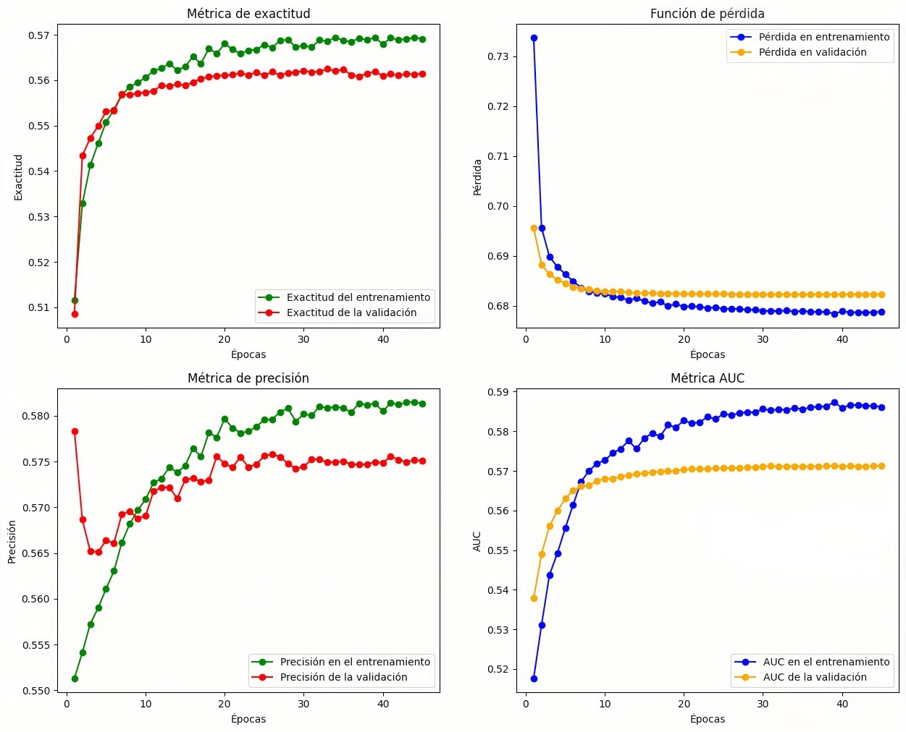
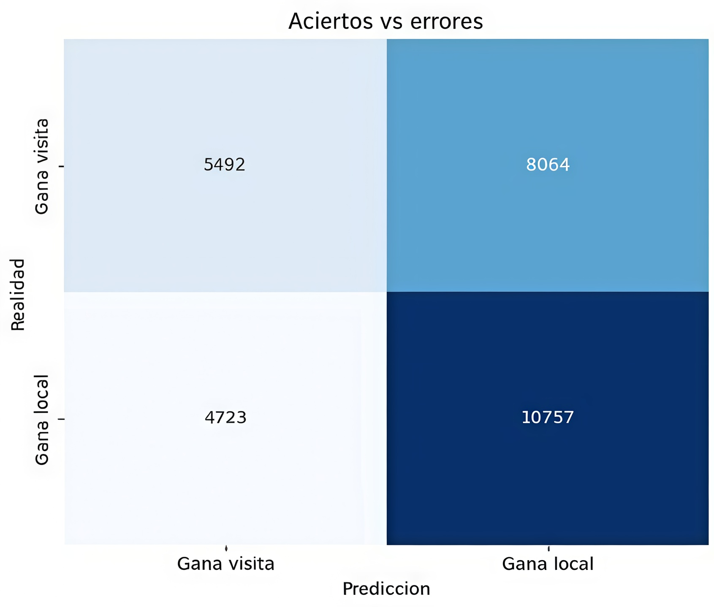

# Predictor de victorias en la MLB - Deep Learning
**Desarrollado por: Rodrigo García Peláez**


Este proyecto implementa una **red neuronal** (NN) capaz de predecir el ganador de partidos de la MLB (Major League Baseball) basándose en estadísticas históricas de los equipos desde 1911 hasta 2024 con una precisión mínima del 56% (con los parámetros originales de este repositorio).

El modelo analiza métricas ofensivas y defensivas para calcular la probabilidad de victoria.

## Arquitectura del modelo
El núcleo del proyecto es una red neuronal densa, construida con librerías **TensorFlow/Keras**:
- **Entrada:** Estadísticas históricas de ambos equipos (promedio de bateo, ERA, victorias recientes, etc...).
- **Capas:** 8 capas densas en total, 6 ocultas.
- **Función de activación:** `Swish` y `sigmoid`
- **Regularización:** Capas de `Dropout`.
- **Optimizador:** `Adam` con tasa de aprendizaje inicial de 0.001.
- **Función de pérdida:** `Binary crossentropy`.
- **Métricas:** `Accuracy`, `precision` y `auc`.
- **Salida:** Probabilidad de victoria del equipo local.
La red se ve de la siguiente forma:
<p align="center">
  
</p>

## Estructura del repositorio
```text
├── datos/                      # Carpeta de archivos 
│   └── teamstats.csv           # Base de datos
├── fuente/                     # Carpeta de códigos fuente
│   ├── modelo.py               # Definición de la arquitectura de la red
│   ├── preprocesamiento.py     # Limpieza y transformación de datos
│   └── particion.py            # División de entrenamiento, validación y prueba
├── modelos/                    # Carpeta de modelos entrenados
│   └── predictor.keras         # Primer modelo de red
├── notebooks/                  # Carpeta de códigos para graficar resultados
│   └── resultados.ipynb        # Grafiación de resultados
├── app.py                      # PROXIMAMENTE - Interfaz web para interactuar con el modelo
├── entrenamiento.py            # Código de entrenamiento de la red
└── requerimientos.txt          # Dependencias del proyecto
```

## Flujo de entrenamiento
El archivo `entrenamiento.py` integra diferentes módulos para transformar la base de datos cruda en un modelo predictivo:

1. **Preprocesamiento e ingeniería de características** (`fuente/preprocesamiento.py`)
- Limpia la base de datos y gestiona los valores nulos.
- Transforma las estadísticas en tensores numéricos.
- Se aplica `StandardScaler`con media 0 y varianza 1 para centrar los datos y facilitar la convergencia de la red.

2. **Partición de datos** (`fuente/partición.py`)
- Gestiona la separación de los datos en conjuntos de entrenamiento, validación y prueba.
- Implementa una lógica que evita la fuga de datos entre temporadas.

3. **Creación del modelo** (`fuente/modelo.py`)
- Crea la topología de la red densa de 6 capas ocultas más 2 de entrada/salida.
- Uso de la función de activación `swish` y capas de `batchNormalization` para estabilizar el gradiente.
- Definición del optimizador `adam` y de la función de pérdida ``binaryCrossentropy`.
- Elección de las métricas de aprendizaje `accuracy`, `precision` y `auc`.

El proceso de entrenamiento no es estático, se controla mediante `callbacks` que monitorean el rendimiento en tiempo real, esto ahorra tiempo y recursos de cómputo. Los `callbacks` utilizados fueron:

- **EarlyStopping:** El entrenamiento se detiene automáticamente si el error en los datos de validación deja de disminuir, optimizando el tiempo de cómputo.
- **ReduceLROnPlateau:** Ajusta dinámicamente la tasa de aprendizaje si el modelo se estanca, sintonizando los pesos de la red.

## Instalación y uso de la red
A continuación se muestran los pasos para poder descargar los archivos y librerías necesarias.

1. **Clonar el repositorio:**
   ```bash
   git clone [https://github.com/RoyGp090703/red_neuronal_mlb.git](https://github.com/RoyGp090703/red_neuronal_mlb.git)
   cd red_neuronal_mlb
   ```

2. **Instalar dependencias:**
   ```bash
   pip install -r requerimientos.txt
   ```

3. **Ejecución**: Si desea reentrenar la red por gusto o por algún cambio de parámetros, solo tiene que ejecutar el comando:
   ```bash
   python entrenamiento.py
   ```

## Resultados

   <p align="center">
  
</p>

<p align="center">
  
</p>


## PRÓXIMOS OBJETIVOS (EN DESARROLLO)
- Creación de una interfaz de usuario para poder hacer predicciones interactivas con la red creada.
- Adaptación de la red a funciones de activación con hiperparámetros.
- Complementación en la base de datos inicial con métricas de sabermetría avanzada en el béisbol.

## Contacto
